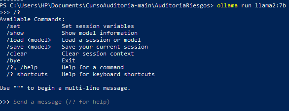
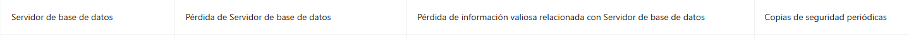
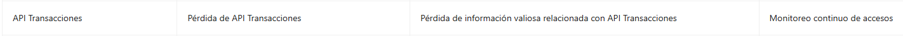

# Gestión de Riesgos para Activos Digitales

## Descripción del Proyecto
Identificación y gestión automatizada de riesgos en activos digitales, que utiliza modelos de lenguaje avanzados ejecutados localmente. La herramienta proporciona:

- Generación automática de perfiles de riesgo
- Análisis de impactos potenciales
- Recomendaciones de mitigación alineadas con ISO 27001
- Interfaz intuitiva para gestión de casos

## Tecnologías Implementadas

### Frontend
- **React 18** con **Vite** (entorno de desarrollo rápido)
- **Ant Design** (biblioteca de componentes UI profesional)
- **Axios** (para comunicación con el backend)

### Backend
- **Flask** (servidor web ligero en Python)
- **Ollama** (infraestructura local para modelos LLM)
- **LangChain** (orquestación de prompts avanzados)
- **LLAMA** (modelo de lenguaje para recomendaciones)

## Requisitos del Sistema

### Dependencias principales
- Visual Studio Code https://code.visualstudio.com
- Node.js v18+ (para el frontend) https://nodejs.org/en/download
- Python 3.9+ (para el backend o la versión más reciente) https://www.python.org/downloads/
- Ollama instalado localmente https://ollama.com
- Git (para clonar el repositorio) https://git-scm.com/downloads

## Instalación y Configuración

### 1. Clonar el repositorio
```bash
git clone https://github.com/OscarJimenezFlores/CursoAuditoria/tree/main/AuditoriaRiesgos
cd AuditoriaRiesgos
```

### 2. Configuración del FRONTEND
```bash
cd frontend
npm install
npm run dev
```
El FRONT estará disponible en: http://localhost:5173

### 3. Configuración del Backend

#### Para usuarios macOS
```bash
brew install ollama
ollama pull llama2:7b
ollama run llama2:7b
```

#### Para usuarios Windows

1. Descargar el instalador desde ollama.com (https://ollama.com)  
2. O puede ejecutar en la terminal de VsCode / PowerShell:

```bash
ollama pull llama2:7b
ollama run llama2:7b
```

   Opcionalmente, puede verificar el estado del servicio:
```bash
tasklist | findstr ollama
```

### 4. Iniciar el BACKEND servidor Flask

```bash
python app.py
```
Nota: Si encuentras problemas con la versión de Python, prueba con el numero de versión Python que instalaste, por ejemplo:
```bash
python3.9 app.py
```

## Solución de Problemas Comunes

#### Errores de dependencias

Ejecuta:
```bash
npm ci --force  # Para frontend
pip install --upgrade -r requirements.txt  # Para backend
```

#### Problemas de compatibilidad

Asegúrate de tener instalado
- Node.js v18+
- Python 3.9+
- Ollama versión estable más reciente

#### Terminar Procesos en MAC terminal
```bash
# Para frontend (React)
pkill -f "npm run dev"

# Para backend (Flask)
pkill -f "python app.py"

# Para Ollama
pkill -f "ollama"
```

#### Terminar Procesos en Windows (VSCode/PowerShell)
```bash
# Para frontend
taskkill /F /IM node.exe

# Para backend
taskkill /F /IM python.exe

# Para Ollama
taskkill /F /IM ollama.exe
```

# Informe de Auditoría de Sistemas - Examen de la Unidad I
- Nombres y apellidos: Jesus Humberto Escalante Alanoca
- Fecha: 10/09/2025
- URL GitHub: https://github.com/JesusEscalante/ExamenU1_Auditoria.git

## 1. Proyecto de Auditoría de Riesgos

### Login
- Evidencia


- Descripción: Se descargó NodeJS en su versión más reciente luego se ejecuto los siguientes comnados: npm install y npm run dev.

### Motor de Inteligencia Artificial
- Evidencia




- Descripción: descargar e instalar el modelo de lenguaje Llama 2 con 7 mil millones de parámetros usando Ollama.

## 2. Hallazgos

### Activo 1: (Servidor de Base de Datos)

- Evidencia:


- Condición: Pérdida de Servidor de base de datos
- Recomendación: Copias de seguridad periódicas
- Riesgo: Probabilidad (Media)

### Activo 2: (API Transacciones)

- Evidencia:


- Condición: Pérdida de API Transacciones
- Recomendación: Monitoreo continuo de accesos
- Riesgo: Probabilidad (Baja)

### Activo 3: (Aplicación Web de Banca)

- Evidencia: 


- Condición: Pérdida de Aplicación Web de Banca
- Recomendación: Cifrado de datos sensibles
- Riesgo: Probabilidad (Media)

### Activo 4: (Servidor de Correo)

- Evidencia:


- Condición: Pérdida de Servidor de Correo
- Recomendación: Monitoreo continuo de accesos
- Riesgo: Probabilidad (Baja)

### Activo 5: (Firewall Perimetral)

- Evidencia:


- Condición: Pérdida de Firewall Perimetral
- Recomendación: Implementación de controles de acceso físico
- Riesgo: Probabilidad (Media)
